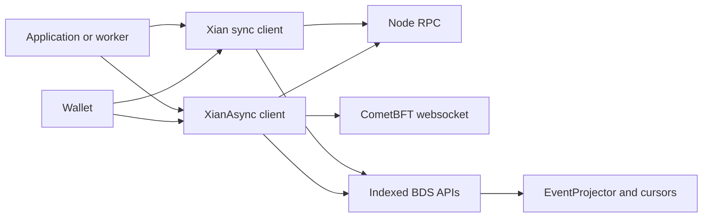

# xian-py

`xian-py` is the Python SDK for talking to Xian nodes from applications,
workers, automation jobs, and operator tooling. It exposes a clean
sync / async client surface over node RPCs, indexed BDS queries, and the
CometBFT websocket, plus reusable projector primitives for building local
read models.

The published PyPI package is `xian-tech-py`. The import package remains
`xian_py`.

## SDK Shape



## Quick Start

Install the SDK:

```bash
pip install xian-tech-py
```

Read state and submit a transaction with the synchronous client:

```python
import os

from xian_py import Wallet, Xian

wallet = Wallet(private_key=os.environ["XIAN_PRIVATE_KEY"])

with Xian("http://127.0.0.1:26657", wallet=wallet) as client:
    balance = client.token().balance_of(wallet.public_key)
    submission = client.token().transfer("bob", 5, mode="checktx")
    print(balance, submission.accepted)
```

Watch indexed events with the async client:

```python
import asyncio

from xian_py import XianAsync


async def main() -> None:
    async with XianAsync("http://127.0.0.1:26657") as client:
        async for event in client.token().transfers().watch(after_id=0):
            print(event.id, event.data)


asyncio.run(main())
```

For low-latency delivery without BDS-backed cursoring, use raw live websocket
events:

```python
import asyncio

from xian_py import XianAsync


async def main() -> None:
    async with XianAsync("http://127.0.0.1:26657") as client:
        async for event in client.token().transfers().watch_live():
            print(event.tx_hash, event.data)


asyncio.run(main())
```

The SDK derives the websocket endpoint from the RPC URL by default
(`http://127.0.0.1:26657` → `ws://127.0.0.1:26657/websocket`). Override with
`WatcherConfig(websocket_url="ws://rpc-host:26657/websocket")`.

For visibility into transport retries, attach a callback to
`RetryPolicy(on_retry=...)`. The callback receives a typed `RetryEvent` with
the operation kind, attempt number, next backoff delay, and exception.

Optional extras:

```bash
pip install "xian-tech-py[app]"   # FastAPI examples
pip install "xian-tech-py[eth]"   # Ethereum-style key helpers
pip install "xian-tech-py[hd]"    # HD-wallet derivation
```

## SDK Cookbook

The examples below assume a running node at `http://127.0.0.1:26657`.
Use `xian-stack` or `xian-cli` to start a local node, then pass the same RPC
URL into the SDK.

Create or import a wallet:

```python
import os

from xian_py import Wallet
from xian_py.wallet import HDWallet

# Generate a fresh Ed25519 account.
wallet = Wallet()
print(wallet.public_key)

# Restore an existing account from a hex private key.
wallet = Wallet(private_key=os.environ["XIAN_PRIVATE_KEY"])

# Optional HD-wallet derivation. Requires: pip install "xian-tech-py[hd]".
hd = HDWallet()
derived_wallet = hd.get_wallet([44, 734, 0, 0, 0])
```

Inspect node and indexer health:

```python
from xian_py import Xian

with Xian("http://127.0.0.1:26657") as client:
    status = client.get_node_status()
    bds = client.get_bds_status()
    print(status.network, status.latest_block_height, status.catching_up)
    print(bds.indexed_height, bds.height_lag, bds.alerts)
```

Read state, simulate a call, and retrieve contract source:

```python
from xian_py import Xian

address = "bob"

with Xian("http://127.0.0.1:26657") as client:
    balance = client.token().balance_of(address)
    raw_balance = client.state_key("currency", "balances", address).get()
    simulated = client.contract("currency").simulate(
        "balance_of",
        address=address,
    )
    source = client.contract("currency").get_source()
    runtime_code = client.contract("currency").get_code()
    print(balance, raw_balance, simulated["result"])
```

Estimate chi, submit a transaction, and wait for finality:

```python
import os

from xian_py import Wallet, Xian

wallet = Wallet(private_key=os.environ["XIAN_PRIVATE_KEY"])

with Xian("http://127.0.0.1:26657", wallet=wallet) as client:
    estimate = client.estimate_chi(
        "currency",
        "transfer",
        {"to": "bob", "amount": 5},
    )
    submission = client.token().transfer(
        "bob",
        5,
        chi=estimate["suggested"],
        mode="checktx",
        wait_for_tx=True,
    )
    print(submission.tx_hash, submission.accepted, submission.finalized)
    if submission.receipt:
        print(submission.receipt.success)
```

Submit a contract from source:

```python
import os

from xian_py import Wallet, Xian

wallet = Wallet(private_key=os.environ["XIAN_PRIVATE_KEY"])
source = """
counter = Variable()

@construct
def seed():
    counter.set(0)

@export
def increment():
    counter.set(counter.get() + 1)
    return counter.get()
"""

with Xian("http://127.0.0.1:26657", wallet=wallet) as client:
    deployed = client.submit_contract(
        "con_counter",
        source,
        mode="checktx",
        wait_for_tx=True,
    )
    result = client.contract("con_counter").send(
        "increment",
        mode="checktx",
        wait_for_tx=True,
    )
    print(deployed.tx_hash, result.tx_hash)
```

Query BDS-backed history:

```python
from xian_py import Xian

address = "bob"

with Xian("http://127.0.0.1:26657") as client:
    recent_blocks = client.list_blocks(limit=5)
    token_balances = client.get_token_balances(address, include_zero=False)
    currency_txs = client.list_txs_by_contract("currency", limit=20)
    transfer_events = client.list_events("currency", "Transfer", after_id=0)
    balance_history = client.get_state_history(f"currency.balances:{address}")
    print(
        len(recent_blocks),
        token_balances.total,
        len(currency_txs),
        len(transfer_events),
        len(balance_history),
    )
```

Use the async client in a service or worker:

```python
import asyncio
import os

from xian_py import Wallet, XianAsync


async def main() -> None:
    wallet = Wallet(private_key=os.environ["XIAN_PRIVATE_KEY"])
    async with XianAsync("http://127.0.0.1:26657", wallet=wallet) as client:
        chain_id = await client.get_chain_id()
        balance = await client.token().balance_of(wallet.public_key)
        submission = await client.token().transfer(
            "bob",
            5,
            mode="checktx",
            wait_for_tx=True,
        )
        print(chain_id, balance, submission.tx_hash)


asyncio.run(main())
```

Build a resumable SQLite projection:

```python
import asyncio
import sqlite3

from xian_py import (
    EventProjector,
    EventSource,
    SQLiteProjectionState,
    XianAsync,
    merged_event_payload,
)


async def main() -> None:
    connection = sqlite3.connect("projection.db")
    connection.row_factory = sqlite3.Row
    connection.execute(
        "CREATE TABLE IF NOT EXISTS transfers "
        "(event_id INTEGER PRIMARY KEY, tx_hash TEXT, amount TEXT)"
    )
    state = SQLiteProjectionState(connection)
    state.init_schema()

    source = EventSource("currency", "Transfer")

    async def apply_transfer(event, _hydrated):
        payload = merged_event_payload(event)
        connection.execute(
            "INSERT OR IGNORE INTO transfers VALUES (?, ?, ?)",
            (event.id, event.tx_hash, str(payload.get("amount"))),
        )
        state.set_int(source.key, event.id or 0)
        connection.commit()
        return True

    async with XianAsync("http://127.0.0.1:26657") as client:
        projector = EventProjector(
            client=client,
            event_sources=[source],
            get_cursor=lambda event_source: state.get_int(event_source.key),
            apply_event=apply_transfer,
        )
        await projector.sync_once()


asyncio.run(main())
```

Tune retries, transaction defaults, and watcher behavior:

```python
from xian_py import (
    RetryEvent,
    RetryPolicy,
    SubmissionConfig,
    WatcherConfig,
    Xian,
    XianClientConfig,
)


def log_retry(event: RetryEvent) -> None:
    print(
        event.operation,
        event.attempt,
        event.max_attempts,
        event.next_delay_seconds,
        event.error,
    )


config = XianClientConfig(
    retry=RetryPolicy(max_attempts=5, on_retry=log_retry),
    submission=SubmissionConfig(mode="checktx", wait_for_tx=True),
    watcher=WatcherConfig(mode="auto", batch_limit=250),
)

with Xian("http://127.0.0.1:26657", config=config) as client:
    print(client.get_chain_id())
```

Talk to a shielded relayer:

```python
from xian_py import ShieldedRelayerClient

with ShieldedRelayerClient("http://127.0.0.1:38480") as relayer:
    info = relayer.get_info()
    quote = relayer.get_quote(
        kind="shielded_command",
        contract="shielded_note_token",
        target_contract="currency",
    )
    print(info.available, quote.relayer_fee, quote.expires_at)
```

## Principles

- **One mental model, two clients.** Sync and async clients stay aligned, so
  the same concepts work in scripts, services, and workers.
- **Explicit transaction submission.** Choose a broadcast mode (`async`,
  `checktx`, `commit`) deliberately. The SDK does not hide retry, blocking, or
  finality behavior.
- **Plumbing, not policy.** Read models and projector loops belong in
  application code. The SDK owns the repetitive plumbing (websocket delivery,
  catch-up cursors, raw CometBFT decoding, typed event conversion).
- **Reference apps live alongside, not inside, the wheel.** Examples
  demonstrate how to integrate Xian into Python systems but are not part of
  the published package.
- **No node orchestration.** Operator workflow and node lifecycle live in
  `xian-cli` and `xian-stack`.

## Key Directories

- `src/xian_py/` — clients, wallet helpers, transactions, models, projectors.
  - `xian.py`, `xian_async.py` — primary sync and async clients.
  - `application_clients.py` — thin helper clients (`contract`, `token`,
    `events`, `state_key`).
  - `transaction.py`, `wallet.py`, `crypto.py` — signing, building, and
    submitting transactions.
  - `projectors.py` — reusable polling, ordering, and checkpoint primitives.
  - `models.py` — typed transaction, event, block, and status models.
  - `shielded_relayer.py` — client for the private-submission relayer.
- `examples/` — service, worker, and reference-app examples built on the SDK
  (`credits_ledger/`, `registry_approval/`, `workflow_backend/`,
  `fastapi_service.py`, `event_worker.py`, `admin_job.py`).
- `tests/` — SDK transport, decoding, and integration-shape coverage.
- `docs/` — compatibility notes and SDK backlog items.

## Capabilities

- read current state via ABCI query paths and simulate readonly contract calls
- retrieve preferred contract source and canonical runtime code separately
- create, sign, and broadcast transactions with explicit `async`, `checktx`,
  and `commit` modes; wait for final receipts
- query indexed blocks, transactions, events, state history, and developer
  reward aggregates from BDS-backed nodes
- watch indexed events with websocket live delivery plus resumable BDS cursors
- watch raw live websocket events without BDS when low-latency delivery
  matters more than replayable cursors
- use thin helper clients for common patterns: contract, token, event, and
  state-key access
- build SQLite-backed read models with the shared projector primitives, using
  CometBFT websocket wakeups and BDS cursor reconciliation

Event watching uses the CometBFT websocket directly and expects a BDS-enabled
node for cursorable indexed catch-up and canonical event IDs. Use
`watch_live_events()` or `.watch_live()` when you explicitly want
websocket-only, non-resumable delivery.

## Core API Layers

- `Xian` / `XianAsync` — primary sync and async clients
- `client.contract(...)`, `client.token(...)`, `client.events(...)`,
  `client.state_key(...)` — thin helper clients for common patterns
- Typed models and error classes — predictable result handling instead of raw
  dictionaries
- `EventProjector`, `EventSource`, `SQLiteProjectionState` — reusable
  polling / ordering / checkpoint primitives for local projections
- `Wallet` — Ed25519 signing helper for Xian transactions

## Typical Use Cases

- backend APIs that read state and submit transactions
- background workers that react to indexed events
- automation jobs that reconcile or administer contracts
- local projections that mirror chain activity into an application-owned
  SQLite read model
- operator or integration scripts that need a clean Python surface over node
  RPCs and indexed queries

## Example Paths

- general SDK examples: [examples/README.md](examples/README.md)
- credits-ledger reference app: [examples/credits_ledger/README.md](examples/credits_ledger/README.md)
- registry-approval reference app: [examples/registry_approval/README.md](examples/registry_approval/README.md)
- workflow-backend reference app: [examples/workflow_backend/README.md](examples/workflow_backend/README.md)

## Validation

```bash
uv sync --group dev
uv run ruff check .
uv run ruff format --check .
uv run pytest
```

## Related Docs

- [AGENTS.md](AGENTS.md) — repo-specific guidance for AI agents and contributors
- [docs/README.md](docs/README.md) — index of internal docs
- [docs/ARCHITECTURE.md](docs/ARCHITECTURE.md) — major components and dependency direction
- [docs/BACKLOG.md](docs/BACKLOG.md) — open work and follow-ups
- [docs/API_COMPATIBILITY.md](docs/API_COMPATIBILITY.md) — compatibility surface and stability guarantees
- [docs/SDK_REVIEW_BACKLOG.md](docs/SDK_REVIEW_BACKLOG.md) — SDK review queue
