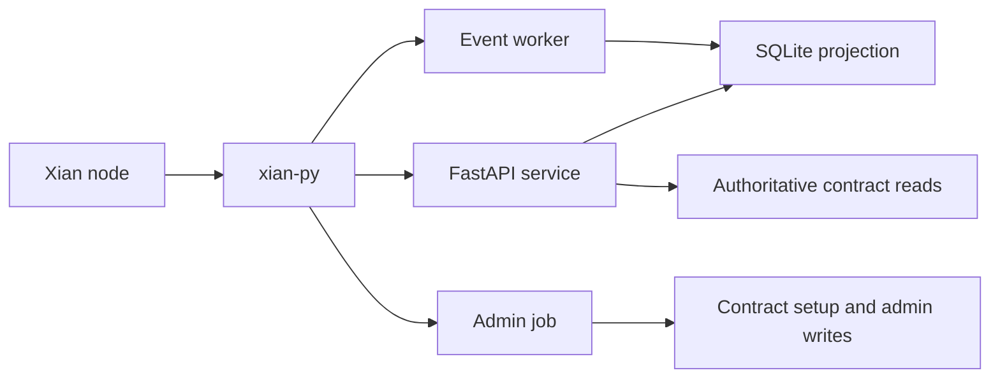

# Examples

## Purpose

This folder contains application-facing examples for integrating `xian-py`
into ordinary software workflows.

## Example Groups

- Basic integration examples:
  - `fastapi_service.py`: an API-service style integration around `XianAsync`
  - `event_worker.py`: a resumable background event consumer
  - `admin_job.py`: a simple automation / health-check style job
- Reference apps:
  - `credits_ledger/`: application-controlled credits ledger with indexed event
    projection
  - `registry_approval/`: shared registry with proposal/approval workflow and
    projected read model
  - `workflow_backend/`: shared workflow/state-machine backend with processor
    and projector workers

## What These Examples Demonstrate

- how to structure a FastAPI service around `xian-py`
- how to run resumable indexed-event workers
- how to build a local SQLite projection from BDS-backed events
- how to combine authoritative on-chain reads with projected application views



## Notes

- These examples are intentionally thin and build on the public SDK surface.
- Install the optional app extra before running FastAPI-based examples:
  `uv sync --group dev --extra app`.
- All examples use environment variables for node URL, chain ID, and optional
  wallet keys so they can be adapted without editing the files.
- The projector-based examples assume a BDS-enabled node.

## Typical Runs

FastAPI service:

```bash
uv sync --group dev --extra app
uv run uvicorn examples.fastapi_service:app --reload --app-dir .
```

Event worker:

```bash
uv run python examples/event_worker.py
```

Admin / automation job:

```bash
uv run python examples/admin_job.py
```

Credits Ledger Pack examples:

```bash
uv sync --group dev --extra app
uv run python examples/credits_ledger/admin_job.py
uv run uvicorn examples.credits_ledger.api_service:app --reload --app-dir .
uv run python examples/credits_ledger/projector_worker.py
```

Registry / Approval Pack examples:

```bash
uv sync --group dev --extra app
uv run python examples/registry_approval/admin_job.py
uv run uvicorn examples.registry_approval.api_service:app --reload --app-dir .
uv run python examples/registry_approval/projector_worker.py
```

Workflow Backend Pack examples:

```bash
uv sync --group dev --extra app
uv run python examples/workflow_backend/admin_job.py
uv run uvicorn examples.workflow_backend.api_service:app --reload --app-dir .
uv run python examples/workflow_backend/processor_worker.py
uv run python examples/workflow_backend/projector_worker.py
```
