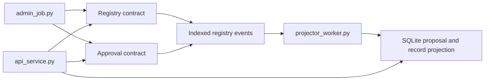

# Registry / Approval Examples

## Purpose

This folder contains the SDK-side integration examples for the Registry /
Approval solution and the deeper reference-app slice built on top of it.

## Files

- `admin_job.py`: bootstrap the registry and approval contracts and manage
  signer setup
- `api_service.py`: read authoritative proposals and records, plus projected
  workflow views for pending approvals and activity
- `projector_worker.py`: rebuild a local SQLite projection from proposal and
  registry events, hydrating rich state from authoritative contract reads
- `event_worker.py`: compatibility wrapper for `projector_worker.py`
- `projection.py`: SQLite-backed proposal, record, and activity projection
- `common.py`: shared environment/config helpers used by these examples

## Environment

Common variables:

- `XIAN_NODE_URL`
- `XIAN_CHAIN_ID`
- `XIAN_WALLET_PRIVATE_KEY`
- `XIAN_REGISTRY_CONTRACT` (default: `con_registry_records`)
- `XIAN_APPROVAL_CONTRACT` (default: `con_registry_approval`)

Optional admin/bootstrap variables:

- `XIAN_REGISTRY_RECORDS_SOURCE_PATH`
- `XIAN_REGISTRY_APPROVAL_SOURCE_PATH`
- `XIAN_REGISTRY_NAME`
- `XIAN_REGISTRY_OPERATOR`
- `XIAN_REGISTRY_SIGNERS` (comma-separated)
- `XIAN_REGISTRY_SIGNER_FUND_AMOUNT` (default: `250`, set `0` to disable)
- `XIAN_REGISTRY_THRESHOLD`
- `XIAN_REGISTRY_RECORD_ID`
- `XIAN_REGISTRY_RECORD_OWNER`
- `XIAN_REGISTRY_RECORD_URI`
- `XIAN_REGISTRY_RECORD_CHECKSUM`
- `XIAN_REGISTRY_RECORD_DESCRIPTION`

Optional worker variable:

- `XIAN_REGISTRY_PROJECTION_PATH`

## Typical Runs

Bootstrap or administer the contracts:

```bash
uv run python examples/registry_approval/admin_job.py
```

When additional signers are configured, the admin job also tops them up with
native balance by default so they can actually approve proposals in local and
reference-app flows.

Run the API service:

```bash
uv run uvicorn examples.registry_approval.api_service:app --reload --app-dir .
```

Run the event worker:

```bash
uv run python examples/registry_approval/projector_worker.py
```

The projector backfills from indexed BDS events and uses authoritative
contract reads to hydrate richer proposal and record views into a local SQLite
database.


